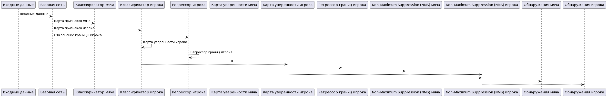

## PlayVision-AI: *Распознавание футболистов и мяча*

Создано командой разработчиков «NoName»

### Аннотация
Статья описывает глубокую нейронную сеть, предназначенную для обнаружения мяча и игроков в высокоразрешенных видеозаписях 
с дальнего расстояния на футбольных матчах. Детектор, получивший название PlayVision-AI, обладает эффективной
полностью сверточной архитектурой и может работать с входным видеопотоком произвольного разрешения. Он создает карту уверенности 
мяча, кодирующую положение обнаруженного мяча, карту уверенности игроков и тензор ограничивающих рамок для игроков, кодирующий их 
положение и ограничивающие рамки. Сеть использует шаблон проектирования Feature Pyramid Network, где нижние уровни признаков с более
высоким пространственным разрешением объединяются с более высокими уровнями признаков с более большим рецептивным полем. Это улучшает
различимость малых объектов (мяча), так как учитывается больший визуальный контекст вокруг интересующего объекта для классификации. 
Благодаря специализированной конструкции, у сети на два порядка меньше параметров, чем у общего детектора объектов на основе глубокой
нейронной сети, такого как SSD или YOLO. Это позволяет обрабатывать видеопотоки с высоким разрешением в режиме реального времени.

### Обзор системы

### Окружающая среда и зависимости
Тестирование кода проводилось на Python 3.11 с PyTorch 2.0.1 на Ubuntu 18.04 с CUDA 10.2.
Зависимости:
* PyTorch (version 2.0.1 or above) 
* opencv-python
* tqdm
* scipy
* PIL

### Наборы данных
**PlayVision-AI** детектор обучается с использованием

<a href="https://drive.google.com/file/d/1rIx_9vMfitWaVrpuocmFJLt-UaV1GdQo/view" target="_blank">Датасет с игроками</a>

<a href="https://drive.google.com/file/d/1H5OiYWTkDDVYVY-AspfP4SJxuuIXAj9B/view?usp=sharing" target="_blank">Видео для тестового прогона</a>
 

### Обучение
Для обучения детектора PlayVision-AI загрузите и распакуйте наборы данных ISSIA-CNR Soccer и SoccerPlayerDetection (при необходимости), отредактируйте файл config.txt и укажите пути к загруженным наборам данных. 
Затем выполните:
    
    python train_detector.py --config config.txt

### Тестирование
Предобученная модель model_20201019_1416_final.pth сохранена в папке models/.
Модель была обучена на наборе данных ISSIA-CNR (камеры 1, 2, 3, 4) и наборе данных SoccerPlayerDetection (набор 1).
Для запуска обученной модели используйте следующую команду:

    python run_detector.py --path data/filmrole4.avi --weights models/model_20201019_1416_final.pth --out_video out_video.avi --device <cpu|cuda>

Это создаст видео с именем, указанным в параметре out_video, 
с рамками вокруг мяча и положения игроков. Уровень уверенности 
обнаружения (в диапазоне от 0 до 1) будет отображаться над каждой рамкой. 
Примеры видео с результатами обнаружения на наборе данных ISSIA-CNR Soccer
 можно скачать здесь:
[camera 5](images/results5.mp4)
[camera 6](images/results6.mp4)
. 

